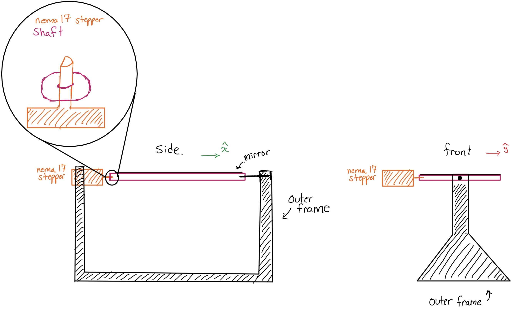
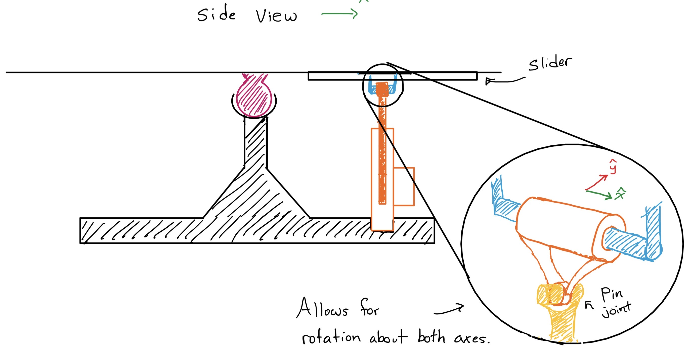
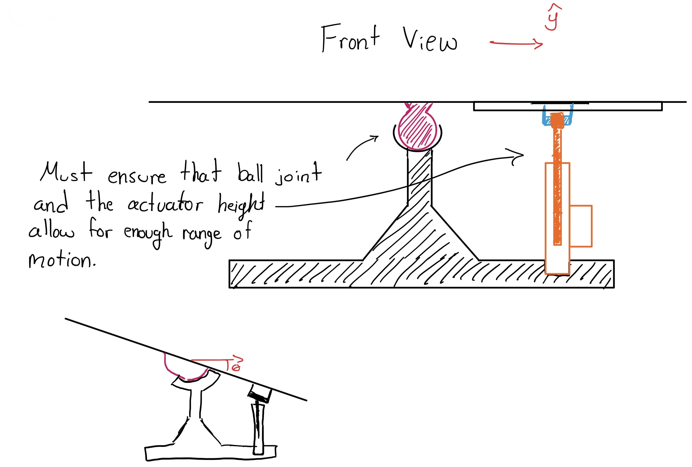

# Sun Reflector
This project solves the problem of precisely reflecting sunlight onto a fixed target by calculating real-time azimuth and elevation angles and actuating a 2-axis mirror system.

## Requirements
- Maintain target alignment within ±1°
- Operate year-round at fixed GPS coordinates
- No obstruction above mirror surface

## Design Concepts
<table>
<tr>
<td width="50%" align="left" valign="top">

<h3 align="center">Outer Frame Design</h3>

<ul>
  <li>Bulky frame required</li>
  <li>Frame blocks one axis of rotation</li>
  <li>Too much rotating mass</li>
</ul>

</td>
<td width="50%" align="center" valign="middle">

</td>
</tr>
</table>

<table>
<tr>
<td width="50%" align="left" valign="top">

<h3> Linear Actuator Design </h3>

<ul>
  <li>Overly complicated joints</li>
  <li>Difficult angle control</li>
  <li>Actuators are overkill and expensive</li>
</ul>

</td>
<td width="50%" align="center" valign="middle">

</td>
</tr>
</table>

### Concept 2 – Failed
- Overly complicated joints
- Difficult angle control
- Expensive

### Final Design
- Independent azimuth/elevation control
- Affordable 

## Analysis
[Derived azimuth/elevation equations →](design/derivations.pdf)

## CAD & Simulation

- NX assembly with motion constraints MAKE ABOVE A LINK TO A 3RD SOURCE ROTABLE 3D MODEL

## Manufacturing
- 3D printing
- Manual assembly

## Results
- Must be physically assembled and tested
