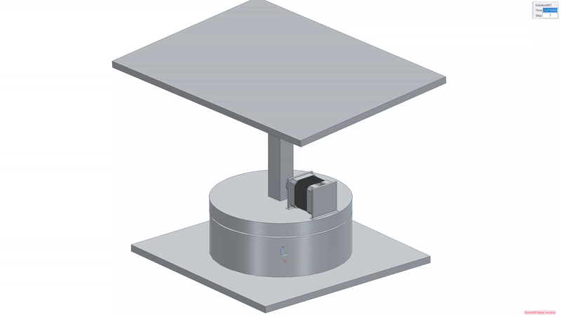

# Sun Reflector
This project solves the problem of precisely reflecting sunlight onto a fixed target by calculating real-time azimuth and elevation angles and actuating a 2-axis mirror system.

## Requirements
- Maintain target alignment within ±1°
- Operate year-round at fixed GPS coordinates
- No obstruction above mirror surface

## Concept 1 - Failed
<table>
<tr>
<td width="50%"
align="left">
### Outer Frame Design
- Bulky frame required
- Frame blocks one axis of rotation  
- Too much rotating mass

</td>
<td width="50%">

</td>
</tr>
</table>

### Concept 1 – Failed
- Bulky frame required
- Frame blocks one axis of rotation
- Too much rotating mass

### Concept 2 – Failed
- Overly complicated joints
- Difficult angle control
- Expensive

### Final Design
- Independent azimuth/elevation control
- Affordable 

## Analysis
[Derived azimuth/elevation equations →](design/derivations.pdf)

## CAD & Simulation

- NX assembly with motion constraints MAKE ABOVE A LINK TO A 3RD SOURCE ROTABLE 3D MODEL

## Manufacturing
- 3D printing
- Manual assembly

## Results
- Must be physically assembled and tested
